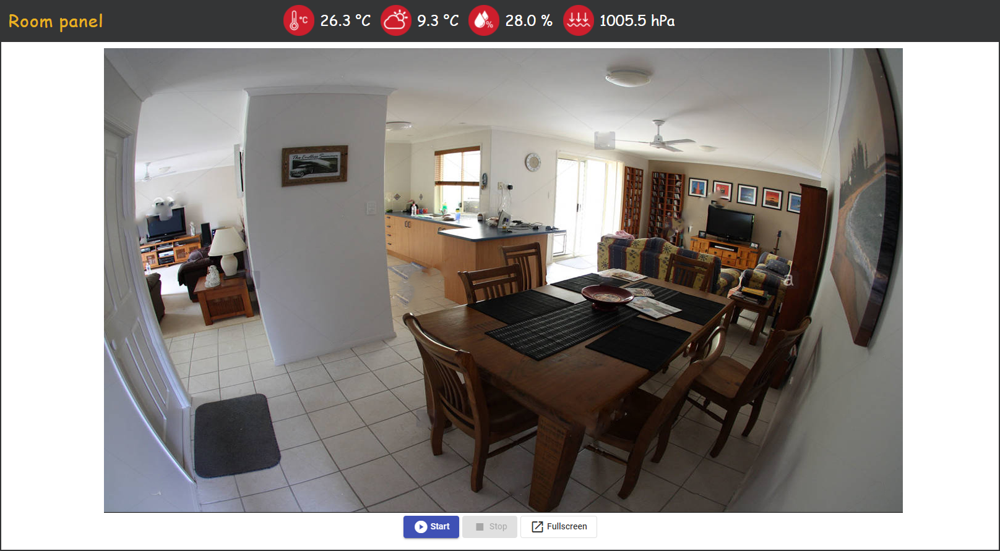

[](https://github.com/LukaszBlasiak/smart-home/actions)
[](https://github.com/LukaszBlasiak/smart-home/actions)

Simple and transparent room monitoring panel with basic environment measurements and weather forecast (OpenWeather API). 
Project is based on Raspberry Pi platform with sensors such as FishEye camera and Bosch BME280.




## Table of Contents
- [Project structure](#project-structure)
- [Docker installation](#docker-installation)
- [Backend service](#backend-service)
  - [Dependencies](#dependencies)
  - [Installation](#installation)
  - [Local deployment (develop)](#local-deployment-develop)
  - [Security](#security)
- [User interface](#user-interface)
  - [Installation](#installation)
- [Raspberry sensors python server](#raspberry-sensors-python-server)
  - [Dependencies](#dependencies)
  - [Installation](#installation)

## Project structure

This project consists of following modules:
* **room-panel-backend**: Java 11 + Spring Framework based REST API Service. Handles either authorization (JWT) and requests from 
  frontend panel (GUI). Also makes calls to external REST API Services in order to obtain necessary data like Raspberry 
  Pi camera image, environment measurements, weather forecast etc.
* **room-panel-frontend**:  Angular 2/11 based user panel that provides either authentication form and camera 
  preview with environment measurements from the backend service.
* **raspberry-sensors-python-server**: Python Flask based REST API Service with internal (localhost) access only. Provides data 
 from Raspberry Pi modules like BME280, FishEye camera etc. This approach is way faster comparing to Java implementation 
  but requires additional HTTP call to Python app not related to Java Spring application.

## Docker installation
In order to deploy application <b>demo</b> (with mocked data) using docker, proceed to root directory of the project and run following command: 
`docker-compose up`. It will result in creation and running two docker images: `backend-service` and `frontend-service`. 
After successful installation, frontend service is accessible on: `localhost:4200`, backend service on: `localhost:8080`
and API documentation on: `http://localhost:8080/swagger-ui.html`.

## Backend service
### Dependencies
Backend service consists of following essential dependencies:
* Java 11
* Spring Boot 2.4
* Spring Security
* JJWT
* Spring Data
* H2 Database Engine
* Liquibase
* Lombok
* MapStruct
* Springfox Swagger 2
* Google Guava
* Apache Commons
* Log4j2
* JUnit 5

The complete list of dependencies along with their versions can be found in `gradle.build` file under 
`room-panel-backend` directory.
### Installation
In this project we can distinguish following profiles:
* **local** - for developing purposes, the Raspberry Pi mocked services are used instead (without accessing Raspberry Pi 
  python API), CORS settings are disabled.
* **prod** - for production usage, all services obtain data from raspberry pi modules (if necessary).  

In order to build project in `.war` format proceed to `src/main/resources` directory and create `application.properties` 
file according to `application-example.properties`.  
Also keep in mind update `log4j2-local.xml` and `log4j2-prod.xml` files accordingly, see the 
[official documentation](https://logging.apache.org/log4j/2.x/manual/configuration.html).

To start build process perform following gradle command: `gradle clean build`. If tests passed successfully proceed to
`build/libs` and locate created `room-panel-backend.war` file.

In last stage copy created `room-panel-backend.war` file into webapps directory under tomcat location. Tomcat environment must have set 
`-Dspring.profiles.active=prod` VM parameter in order to pick up correct profile settings. In addition - don't forget to
secure tomcat accordingly as well :)

### Local deployment (develop)
In order to start application in `local` mode just import files within IntelliJ Idea as a gradle project and set
`-Dspring.profiles.active=local` VM parameter. After successful deployment, swagger API documentation is accessible at
`http://localhost:8080/swagger-ui.html`.
### Security
Authorization is based on JWT standard with SHA-512 hash algorithm. In addition, check 
[UserDetailsServiceImpl](room-panel-backend/src/main/java/pl/blasiak/security/service/UserDetailsServiceImpl.java)
for default user credentials.

## User interface
### Installation
In this project we can distinguish following profiles:
* **local** - for developing purposes, GUI is accessing backend service on localhost machine, CORS settings are disabled.
* **prod** - for production usage, all services obtain data from production backend service.

Open `config.ts` file and update following variables located at the beginning of the file:
* **LOCAL_API_BASE_URL**: Backend service base URL for local profile, by default it's: `http://localhost:8080`.
* **PROD_API_BASE_URL**: Backend service base URL for prod profile, example: `https://ddns-domain.com:8443/room-panel-backend`.

To start build process perform following npm command: 
* for local profile: `ng serve`
* for production profile: `npm run build:prod` (alias for ng build --prod --base-href="/room-panel/")

In the last stage proceed to created directory `room-panel-frontend` under `dist` and copy its content into `webapps/room-panel` directory 
under tomcat location. Keep in mind that Angular2 is SPA application, and it needs redirections to index.html. To do so
[check this answer](https://stackoverflow.com/a/39482787) or study official documentation of your hosting server. 

## Raspberry sensors python server
### Dependencies
Python service consists of following essential dependencies:
* Python 3
* [Flask](https://pypi.org/project/Flask/)
* [RPi.bme280](https://pypi.org/project/RPi.bme280/)
* [picamera](https://pypi.org/project/picamera/)
### Installation
Make sure that everything is connected properly and safe:

Open `raspberry-sensors-python-backend.py` file and update following variables located at the beginning of the file:
* **APP_KEY**: Api key that client must provide to access endpoints 
* **CAMERA_WIDTH**: output width of captured image from camera
* **CAMERA_HEIGHT**: output height of captured image from camera
* **BME_ADDRESS**: I2C address of BME280 sensor. In most cases it's 0x76.

In order to run python service just proceed to `raspberry-sensors-python-backend.py` file location in terminal and execute 
`python3 raspberry-sensors-python-backend.py` command.
By default endpoints are accessible only internally (within localhost). For debugging purposes you can expose 
application by run application using 
```python
app.run(host= '0.0.0.0')
```
instead of 
```python
app.run()
```
 (at the end of `raspberry-sensors-python-backend.py` file).
